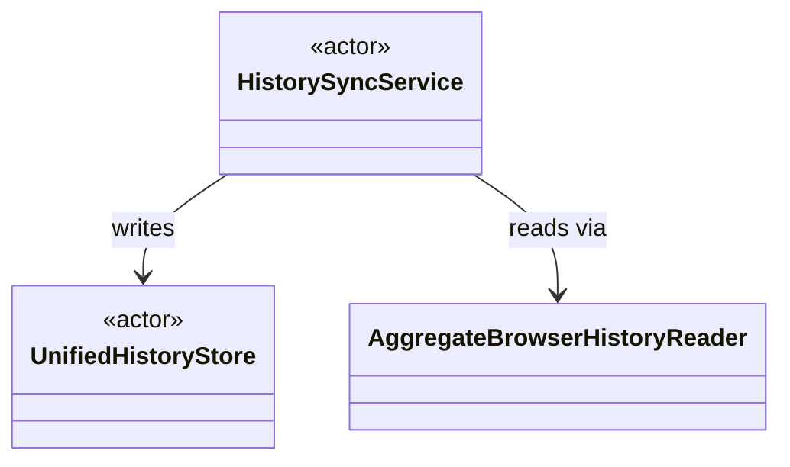

# Architecture Design

Concrete over abstract. Every type, field, and method signature in this output must be a real decision, not a placeholder — the point is that these decisions get made now, in the open, not silently during implementation.

## Destination

Ask which, if not obvious from context:

- **Plan mode** — output becomes part of the current plan file's Design section, same file, same terse rules from `planning.md` (bullets, backticks, grouping).
- **Doc mode** — output is a standalone repo file. Default path `docs/design/<feature-slug>.md` unless the user names a different target (e.g. updating an existing doc).

Same notation either way. Only the destination differs.

## Notation

**Data models** — one table per type, not prose:

| Field | Type | Notes |
|---|---|---|
| `id` | `UUID` | primary key |
| `title` | `String` | non-empty, display copy |

**Relationships** — one small Mermaid diagram, only the types relevant to this feature (not the whole app):



Use `sequenceDiagram` instead when call *order*/timing matters more than static structure (async flows, multi-step operations) — pick one, not both, unless order is genuinely non-obvious from the class diagram alone.

**Interfaces** — real language syntax, fenced code block, signatures only, no bodies:

```swift
protocol BrowserHistorySearching: Sendable {
    func search(query: String) async -> [HistoryEntry]
    func recent() async -> [HistoryEntry]
}
```

## Process

1. List the types/components this feature touches — new and existing. Pull from the plan's Inspect section if in plan-mode; ask the user if in doc mode.
2. Data model table per new/changed type.
3. One relationship diagram covering only those types.
4. Signature-only interface block per new/changed protocol or public API surface.
5. Write to the destination from step "Destination" above.
6. One-line confirmation of what was written and where — don't restate the content back.

## Not this skill

- APP.md / DOMAIN.md / PACKAGES.md content → `swift-project-init-docs`.
- Full UML (multiplicities, stereotypes beyond `<<actor>>`-style hints, formal notation) — deliberately not used here, Mermaid stays lightweight.
- A fix small enough that no data model or relationship actually changes — skip this skill, plan normally.
